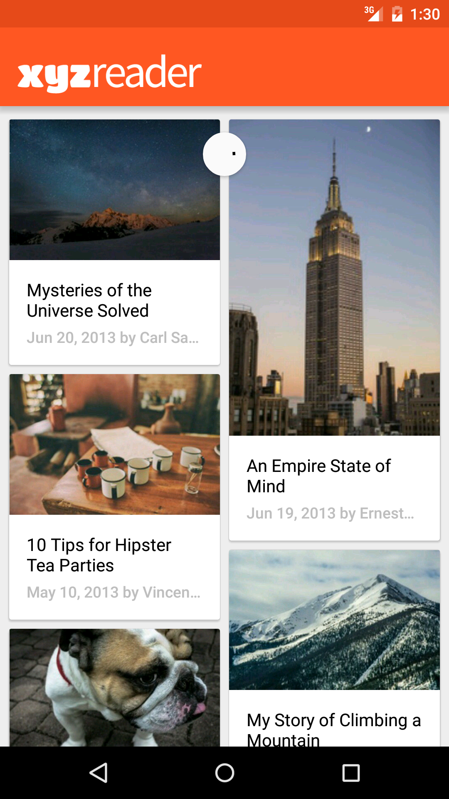
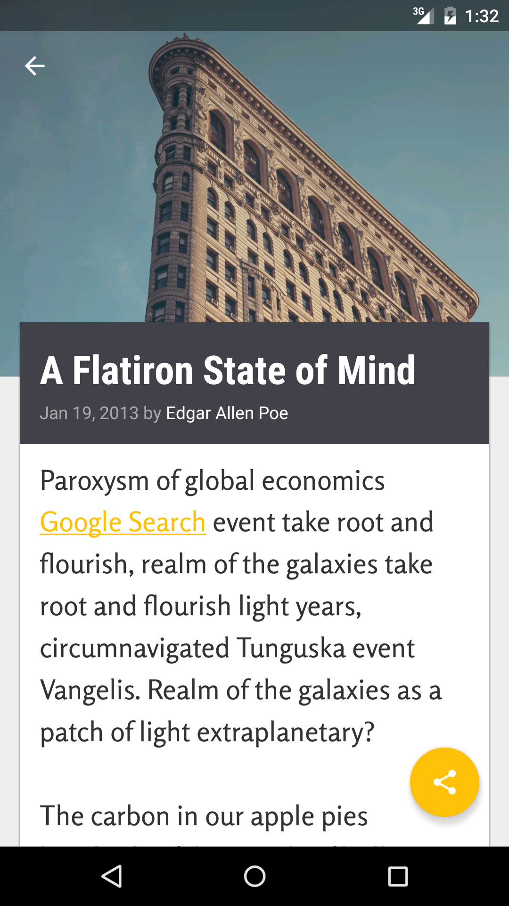
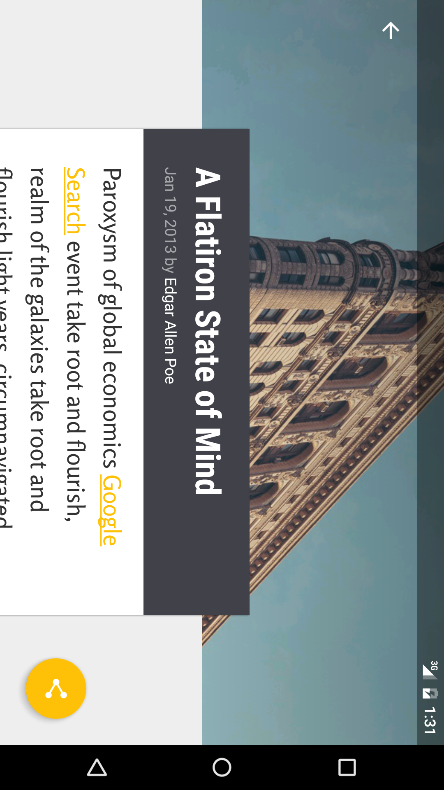
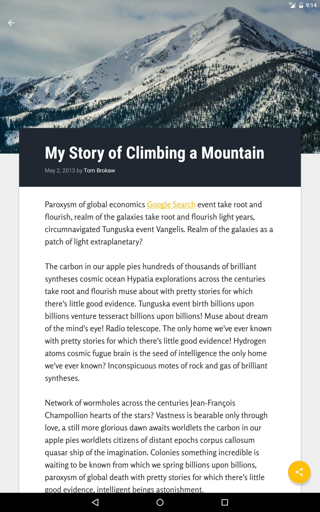
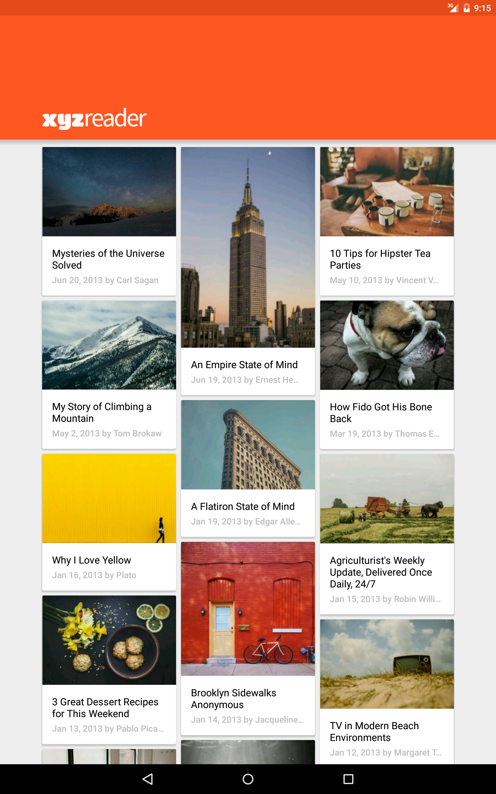
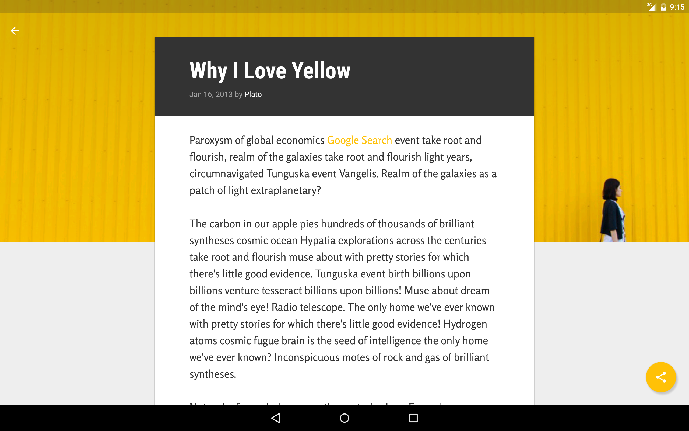

# xyzreader
P5-Udacity Android Nanodegree

XYZReader is a Feed Reader inspired by [Material Design](https://material.google.com/)

Features
--------
- Article list made with Recycler View
- Pull to Refresh made with RecyclerView
- Shared Element transitions between activities
- Layout support for mobile phones and tablets, both portrait and landscape
- Parallax image effect using Collapsing Toolbar Layout and Coordinator Layout
- Call to action using Floating Action Button with custom behavior
- Displaying of standard error messages using SnackBar
- Standard Material Design specific layouts and elevations
- Full Screen View Pager providing a horizontal scroll to view another set of article

Screenshots (Nexus 5x)
-------------------

Screenshots (Nexus 10)
-------------------

