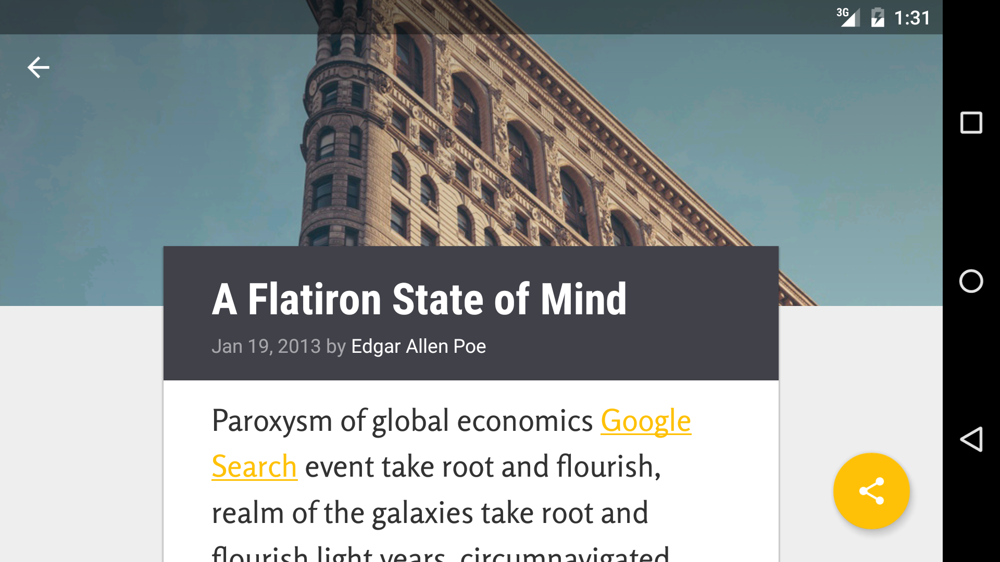

# xyzreader
P5-Udacity Android Nanodegree

XYZReader is a Feed Reader inspired by [Material Design](https://material.google.com/)

Screenshots (Nexus 5x)
-------------------

Screenshots (Nexus 10)
-------------------

